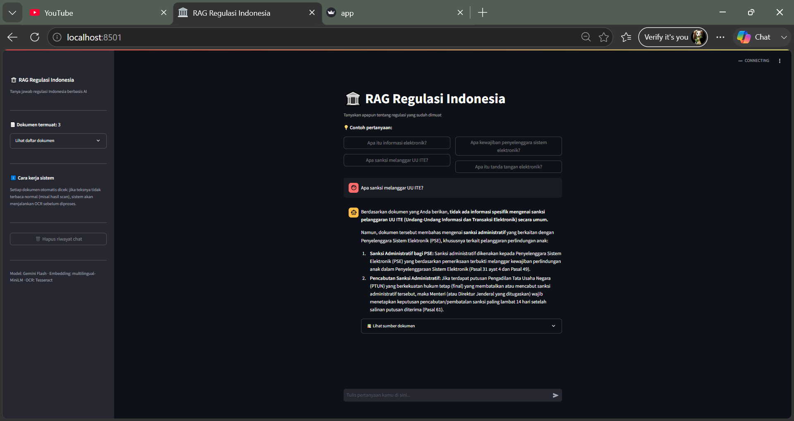

# 🏛️ RAG Regulasi Indonesia

Sistem tanya-jawab berbasis AI untuk regulasi pemerintah Indonesia. Pengguna bisa bertanya dalam bahasa natural dan mendapat jawaban yang diambil langsung dari dokumen regulasi resmi (UU, PP, Permen, dll), lengkap dengan kutipan sumber.

## Mengapa project ini dibuat

Regulasi pemerintah Indonesia umumnya berbentuk PDF panjang yang sulit dicari isinya secara cepat. Project ini membangun pipeline **RAG (Retrieval-Augmented Generation)** yang memungkinkan pencarian semantik atas isi dokumen, lalu menghasilkan jawaban natural berbasis konteks yang ditemukan — bukan jawaban generik dari pengetahuan umum LLM.

## Demo



## Arsitektur

```
PDF Regulasi (docs/)
      │
      ▼
┌─────────────────────┐
│ Deteksi kualitas teks│  → cek apakah hasil extract teks "wajar" atau garbage
└─────────────────────┘
      │
   ┌──┴──┐
   │     │
teks   PDF hasil scan
asli        │
   │        ▼
   │   OCR (Tesseract)
   │        │
   └────┬───┘
        ▼
┌─────────────────────┐
│ Chunking & Embedding │  → HuggingFace multilingual-MiniLM
└─────────────────────┘
        ▼
┌─────────────────────┐
│   ChromaDB (vector)  │  → persistent storage
└─────────────────────┘
        ▼
   Query pengguna
        │
        ▼
┌─────────────────────┐
│  Similarity Search   │  → ambil top-3 chunk paling relevan
└─────────────────────┘
        ▼
┌─────────────────────┐
│   Gemini Flash API   │  → generate jawaban dari konteks
└─────────────────────┘
        ▼
   Jawaban + sumber
```

## Tech stack & alasan pemilihan

| Komponen | Pilihan | Alasan |
|---|---|---|
| Orkestrasi RAG | LlamaIndex | Abstraksi siap pakai untuk chunking, indexing, retrieval |
| Vector store | ChromaDB | Ringan, persistent secara lokal, tidak perlu server terpisah |
| Embedding | `paraphrase-multilingual-MiniLM-L12-v2` | Mendukung Bahasa Indonesia, ringan untuk CPU |
| LLM | Gemini Flash (REST API) | Gratis untuk volume kecil, performa cepat untuk QA |
| OCR | Tesseract + Poppler | Banyak dokumen regulasi resmi berupa hasil scan, bukan PDF teks asli |
| Interface | Streamlit | Cepat untuk prototyping aplikasi data/AI |

## Tantangan teknis & solusi

Bagian ini sengaja ditulis detail karena proses debugging-nya adalah bagian paling berharga dari project ini.

### 1. Sebagian PDF regulasi adalah hasil scan, bukan teks asli

Ekstraksi teks awal menghasilkan karakter acak (`♦☻♂↨`, dst) untuk beberapa dokumen. Investigasi menunjukkan dokumen tersebut sebenarnya gambar hasil scan yang disisipkan ke dalam struktur PDF (`CCITTFaxDecode`, dsb), bukan teks yang bisa diekstrak langsung.

**Solusi:** sistem mendeteksi otomatis rasio "kata yang terlihat normal" dari hasil ekstraksi. Jika rasio terlalu rendah, dokumen diproses ulang lewat Tesseract OCR (convert ke gambar per halaman via Poppler, lalu OCR dengan bahasa Indonesia).

### 2. Loading lambat setiap kali aplikasi di-restart

`VectorStoreIndex.from_documents()` selalu memproses ulang seluruh dokumen dari nol, padahal ChromaDB sudah punya data persisten dari proses sebelumnya.

**Solusi:** cek `collection.count()` sebelum memutuskan apakah perlu membangun index dari awal atau cukup load index yang sudah ada (`from_vector_store`).

### 3. Konflik versi dependency (`torch`, `transformers`, `sentence-transformers`)

Upgrade satu library memicu `ModuleNotFoundError` di library lain karena versi yang tidak saling kompatibel — termasuk kebutuhan `torchvision` yang sebelumnya tidak terpasang.

**Solusi:** pin versi spesifik di `requirements.txt` yang sudah terbukti kompatibel satu sama lain.

### 4. Gemini API tidak selalu stabil (503/timeout)

**Solusi:** retry otomatis dengan backoff (2s, 4s, ...) hingga 3 kali percobaan, dengan fallback pesan yang ramah ke pengguna jika seluruh percobaan gagal.

## Cara menjalankan

### 1. Clone & install dependency

```bash
git clone <repo-url>
cd rag-regulasi-indonesia
pip install -r requirements.txt
```

### 2. Install OCR engine (Windows)

- **Tesseract OCR**: download dari [github.com/UB-Mannheim/tesseract/wiki](https://github.com/UB-Mannheim/tesseract/wiki), install, lalu download [`ind.traineddata`](https://github.com/tesseract-ocr/tessdata/raw/main/ind.traineddata) dan letakkan di folder `tessdata` Tesseract.
- **Poppler**: download dari [github.com/oschwartz10612/poppler-windows/releases](https://github.com/oschwartz10612/poppler-windows/releases), extract ke lokasi tetap.
- Sesuaikan path Tesseract dan Poppler di bagian atas `app.py`.

### 3. Setup API key

Buat file `.env`:
```
GEMINI_API_KEY=your_api_key_here
```

Dapatkan API key dari [Google AI Studio](https://aistudio.google.com/apikey).

### 4. Siapkan dokumen

Letakkan file PDF regulasi di folder `docs/`. Sistem mendukung baik PDF teks asli maupun hasil scan.

### 5. Jalankan

```bash
streamlit run app.py
```

## Struktur project

```
rag-regulasi-indonesia/
├── app.py              # Aplikasi utama
├── requirements.txt    # Dependency Python
├── .env                # API key (tidak di-commit)
├── docs/               # Dokumen PDF regulasi
└── chroma_db/          # Vector store (auto-generated, tidak di-commit)
```

## Keterbatasan saat ini

- Cakupan dokumen masih terbatas pada regulasi yang sudah dikumpulkan manual
- OCR meningkatkan waktu proses awal secara signifikan untuk dokumen hasil scan
- Belum ada mekanisme update otomatis ketika ada dokumen baru ditambahkan tanpa restart aplikasi

## Potensi pengembangan

- Tambah sumber dokumen otomatis via scraping dari situs JDIH resmi
- Re-ranking hasil retrieval untuk akurasi lebih tinggi
- Evaluasi kualitas jawaban (RAG evaluation metrics)
